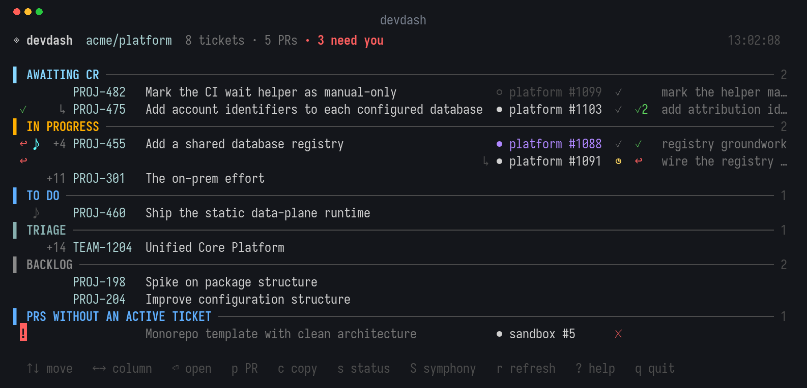

# devdash

Your assigned JIRA tickets and the pull requests addressing them, on one page, in
your terminal.

[](https://github.com/tptodorov/devdash/actions/workflows/ci.yml)
[](https://go.dev)
[](LICENSE)



## Try it in one command

No install, no credentials, nothing to configure — this renders the screenshot
above with sample data:

```bash
go run github.com/tptodorov/devdash@latest -demo
```

Once you have the four environment variables from [Configure](#configure), the
same command shows your real tickets:

```bash
go run github.com/tptodorov/devdash@latest
```

`go run` compiles and runs it in one step, so it is the quickest way to try devdash
without adding a binary to your `PATH`. If you decide to keep it, see
[Install](#install).

## Why

The state of your own work is spread across three places: the JIRA board says what
is assigned to you, GitHub says which pull requests exist, and neither knows about
the other. Reconciling them is a tab-switching exercise you repeat all day.

devdash puts them on one line each. It also closes three gaps that cost real time:

- **A merged PR vanishes from `is:open` searches**, so a ticket still in review
  looks like it has no PR at all. devdash fetches recently merged PRs too.
- **Approvals can be invisible.** GitHub reports no review decision when the base
  branch requires none, so an approved PR looks unreviewed. devdash counts
  approving reviews as well as reading the decision.
- **Changing a ticket's status meant leaving the terminal.** Press `s`.

## Requirements

- **Go 1.25+** to install
- **A JIRA API token** — create one at
  [id.atlassian.com](https://id.atlassian.com/manage-profile/security/api-tokens)
- **A GitHub token** with `repo` scope

A [Nerd Font](https://www.nerdfonts.com/) is recommended for the pull request
icons. Without one, run with `-no-nerd-font`.

## Install

```bash
go install github.com/tptodorov/devdash@latest
```

That puts `devdash` in `$(go env GOPATH)/bin`. Make sure that is on your `PATH`,
or set `GOBIN` first:

```bash
GOBIN="$HOME/.local/bin" go install github.com/tptodorov/devdash@latest
```

## Configure

Four environment variables. Add them to your shell profile:

```bash
export JIRA_URL='https://your-org.atlassian.net'
export JIRA_USERNAME='you@your-org.com'      # your Atlassian account email
export JIRA_API_TOKEN='...'                  # from id.atlassian.com
export GITHUB_TOKEN='...'                    # a token with repo scope
```

If you already use the GitHub CLI, the token is one command away:

```bash
export GITHUB_TOKEN=$(gh auth token)
```

Check what devdash can see:

```bash
devdash help          # the REQUIREMENTS section reports each variable as set or missing
```

## Quick start

```bash
cd ~/code/your-repo
devdash                 # or: go run github.com/tptodorov/devdash@latest
```

Run from inside a repository and the pull requests are narrowed to it; the header
says which one. Run from anywhere else and every repo you have PRs in is included.

```bash
devdash -demo           # sample data, no credentials needed — see it before you set it up
devdash --help          # everything below, plus every API call the tool makes
devdash -once           # print one snapshot and exit, for piping or a cron job
devdash -refresh 30s    # slow the auto-refresh down
devdash -all-repos      # ignore the current repository, show everything
```

## Keys

| Key | Action |
| --- | ------ |
| `↑`/`k`, `↓`/`j` | move between rows |
| `←`/`h`, `→`/`l` | move between the columns of the selected row |
| `g` / `G` | jump to the first / last row |
| `enter` | open whatever the selected column points at |
| `o` | open the ticket, whichever column is selected |
| `p` | open the selected row's pull request |
| `c` | copy a shareable snippet: title, ticket link, every PR link |
| `s` | change the selected ticket's status |
| `S` | schedule the ticket for Symphony, or take it back unless an agent is running |
| `r` | refresh now |
| `a` | pause or resume the automatic refresh |
| `?` | keys, icons, and the issue types currently on screen |
| `q`, `esc`, `ctrl+c` | quit |

Ticket keys and PR references are OSC 8 hyperlinks — ⌘-click them in iTerm2,
Ghostty, WezTerm, Kitty or any terminal that supports links.

## Column navigation

Left and right walk the columns of the selected row, which is highlighted in a
contrasting colour. Enter opens whatever that column points
at:

| Column | `enter` opens |
| ------ | ------------- |
| ticket | the ticket in JIRA |
| children | a JIRA search for its sub-tickets |
| pull request | that pull request — each PR on the row is its own column |
| Symphony | the Symphony dashboard |

```
  T   4 PROJ-455  Add a shared database registry  →   platform #1088 󰄴 rev✓ +1  ♪
        │  └──────────────┬─────────────────┘             └──────┬──────┘      │
        │                 │                                     │             │
        └ children        └ ticket                               └ PR          └ Symphony
                                                     the second PR is the next column,
                                                     on the line below
```

Columns appear only when they do on screen, so left and right never land
somewhere that would do nothing: a ticket with no children, no PR and no Symphony
session has a single column. `o` still opens the ticket from anywhere on the row.

## Reading a row

```
  ST    PROJ-475   Add account identifiers to each database   →   platform #1103 󰄴 rev✓   ♪
  │  │  │          │                                              │          │  │       │
  │  │  │          └ summary                                      │          │  │       └ Symphony
  │  │  └ ticket key, linked to JIRA                              │          │  └ review
  │  └ sub-tickets, blank when none                               │          └ checks
  └ issue type                                                    └ pull request, linked
```

**Issue type** is the initial of each word in the type's name: `Task` → `T`,
`Sub-task` → `ST`, `New Feature` → `NF`. Nothing is hard-coded, so it works on any
project's workflow. The `?` help lists the codes actually on screen, which is also
where you can see if two types happen to share one.

**Pull requests** show state, checks and review:

| | Nerd Font | Plain | Meaning |
| --- | --- | --- | --- |
| state | `\uf407` | `●` | open |
| | `\uf4dd` | `○` | draft |
| | `\uf419` | `◆` | merged |
| | `\uf4dc` | `×` | closed without merging |
| checks | `\U000f0134` | `✓` | passing |
| | `\U000f0159` | `×` | failing |
| | `\U000f051f` | `◷` | still running |

The icons match [workmux](https://github.com/raine/workmux), so the two read the
same way side by side. The reference is also coloured by state, so it still reads
if a glyph cannot be drawn.

| Review badge | Meaning |
| --- | --- |
| `rev✓` | approved; `rev✓3` means three approving reviews |
| `rev±` | changes requested |
| `rev?` | awaiting review |

Tickets are grouped by status, most urgent first, and each group is coloured.

## Changing a ticket's status

Press `s`. The choices come from JIRA's transitions API for that specific issue,
so they are exactly what your workflow permits from its current state.

```
╭─ PROJ-482 ────────────────────────────────────────────╮
│ Mark the CI wait helper as manual-only                │
│ now: Awaiting CR                                      │
│                                                       │
│ ▸ 1 To Do                                             │
│   2 In Progress                                       │
│   3 Awaiting Verification  via "Done"                 │
│   4 Closed  +1 step                                   │
│   8 Awaiting CR  (current)                            │
│                                                       │
│ ↑↓ choose   ⏎ select   esc cancel   o open            │
╰───────────────────────────────────────────────────────╯
```

`1`–`9` jump straight to a choice. Two details that matter:

- **The destination status is shown, not the transition's name.** They differ more
  often than you would expect — a transition called *Done* can move an issue to
  *Awaiting Verification*. Where they differ, the transition's own name appears as
  `via "Done"`.
- **`+1 step`** marks a transition that needs a value first, such as a resolution
  when closing. You get a second prompt listing the allowed values.

Auto-refresh pauses while the panel is open, so rows cannot move under you.

## Sharing

Press `c` to copy the selected row as text you can paste to whoever should look at
it:

```
PROJ-482 — Mark the CI wait helper as manual-only
https://your-org.atlassian.net/browse/PROJ-482
https://github.com/acme/platform/pull/1099
```

Bare URLs, so they unfurl in Slack. A ticket with several PRs contributes all of
their links. Nothing that goes stale is included — no status, no CI state.

## Symphony (optional)

Tickets that a local [Symphony](https://github.com/openai/symphony) has in hand,
or has been given, are marked in a column at the right-hand edge:

| Marker | Meaning |
| --- | --- |
| `♪` grey | scheduled, waiting for Symphony to pick it up |
| `♪` | Symphony is working on the ticket |
| `!` | paused waiting for operator input or approval |
| `↻` | waiting for the next retry window |

`S` toggles. On a ticket Symphony would pick up it strips the required labels
again, which is enough to release the ticket: Symphony re-reads the labels before
it retries or reconsiders a blocked issue, so stuck work can be taken back, fixed,
and scheduled afresh. Only a ticket an agent is actively running is refused, since
removing a label cannot interrupt a turn already in progress — stop that session in
Symphony instead. Unrelated labels and the ticket's status are left alone.

The instance is located from the `server` block of `WORKFLOW.md`'s front matter,
searching upward from the working directory:

```yaml
---
server:
  port: 10000
---
```

Discovery and the query are repeated on every refresh, since Symphony starts and
stops independently. If it is not running the column disappears entirely and
nothing is reported — that is the ordinary case.

## Reference

| Flag | What it does | Environment | Default |
| ---- | ------------ | ----------- | ------- |
| `-demo` | show sample data instead of contacting JIRA or GitHub; needs no credentials | — | real data |
| `-once` | print one snapshot and exit instead of running the interactive UI | — | interactive |
| `-refresh` | auto-refresh interval, e.g. `30s` or `2m`; `0` disables it | `DEVDASH_REFRESH` | `10s`, minimum `2s` |
| `-all-repos` | show pull requests from every repository, not just this directory's | — | scoped to this repo |
| `-jql` | JQL selecting which tickets to show | `DEVDASH_JQL` | assigned to you, not Done |
| `-pr-query` | GitHub search selecting which pull requests to show; overrides repo scoping | `DEVDASH_PR_QUERY` | open and recently merged, scoped to this repo |
| `-include-archived` | keep pull requests whose repository is archived | — | archived hidden |
| `-no-nerd-font` | use plain Unicode instead of Nerd Font glyphs | — | Nerd Font glyphs |
| `-no-links` | render plain text instead of OSC 8 terminal hyperlinks | — | hyperlinks on |

There is also a `help` subcommand, which reports whether each required
environment variable is set and lists every API call the tool makes:

```bash
devdash help
devdash help -no-nerd-font    # describes the plain glyph set instead
```

Scope it to a project or an organisation by overriding the queries:

```bash
devdash -jql 'assignee = currentUser() AND project = PROJ AND statusCategory != Done ORDER BY updated DESC'
devdash -pr-query 'author:@me is:pr is:open org:your-org'
```

An explicit `-pr-query` is run exactly as written, with no repository scoping and
no state filtering — ask for closed PRs and you get them.

## How it works

**Correlation.** A pull request attaches to a ticket when a JIRA key appears in its
**title**, falling back to its **branch name**. PRs matching no active ticket are
listed under their own heading rather than hidden, because they still need
something from you.

**Which PRs are fetched.** Open ones, plus any merged in the last 30 days —
so a ticket still in review keeps showing the PR that did the work. Closed without
merging is excluded as abandoned. A *merged* PR matching no active ticket is
dropped rather than listed; it is finished work, and there can be hundreds.

**Repository scope.** The owner and name are read from `.git/config` directly — no
`git` subprocess — then confirmed against the API. That second step matters: a
renamed repository keeps its old URL in the remote, and GitHub's search does not
follow renames, so searching the stale name silently matches nothing.

**Archived repositories** are skipped. GitHub keeps returning their PRs forever,
but they cannot be merged. `-include-archived` brings them back.

**No external binaries** are needed for data. JIRA and GitHub are called over
HTTPS. `pbcopy`/`xclip` and `open`/`xdg-open` are used only for the clipboard and
the browser, and only when you press `c` or `enter`.

Nothing is written anywhere except the clipboard, and JIRA when you press `s`.

## Troubleshooting

**"0 tickets" or an authentication error.** Run `devdash help` and check the
REQUIREMENTS table — it reports each variable as set or missing. Note that JIRA
answers an unauthenticated search with `200` and an empty list, so devdash verifies
your identity separately rather than reporting an empty backlog; an expired token
shows as an explicit error.

**Every icon is a blank box.** Your terminal font is not a Nerd Font. Run with
`-no-nerd-font`, or install one.

**A ticket shows `no PR` when you know there is one.** The key must appear in the
PR's title or branch name. Check the spelling, and note that scoping to the current
repository hides PRs in other repositories — try `-all-repos`.

**No colour when piping.** Expected: colour is dropped when the output is not a
terminal. `-once -no-links` gives clean text for scripts.

## Contributing

Issues and pull requests are welcome.

```bash
git clone https://github.com/tptodorov/devdash
cd devdash
go test ./...
go build -o devdash .
./devdash -demo          # no credentials needed
```

CI runs on every push and pull request: `gofmt`, `go vet`, `go test -race -cover`,
and a cross-build for macOS and Linux on amd64 and arm64. Running `gofmt -l .` and
`go test ./...` locally is enough to predict it.

The README screenshot is generated from demo data, so it never contains anyone's
real tickets. To regenerate it after a change to the interface:

```bash
pip install Pillow
go build -o devdash .
python3 scripts/screenshot.py ./devdash docs/screenshot.png
```

It needs a [Nerd Font](https://www.nerdfonts.com/) installed to draw the pull
request glyphs. `TestDemoDataCoversEveryState` keeps the sample data covering
everything the documentation claims to show.

To see what `S` would do to every one of your tickets without changing anything:

```bash
DEVDASH_DRYRUN_DIR=/path/to/repo go test -run TestDryRunSchedulePlans -v
```

One test suite talks to real JIRA and is skipped unless you point it at a ticket
you do not mind moving. It transitions the ticket and moves it back:

```bash
DEVDASH_LIVE_TICKET=PROJ-482 go test -run TestLiveTransitionRoundTrip -v
```

## Licence

[MIT](LICENSE)
